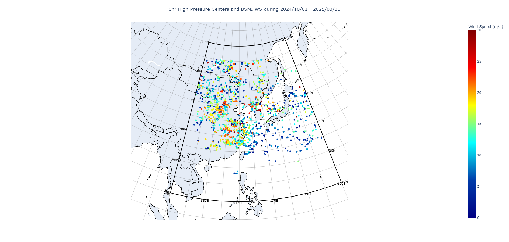
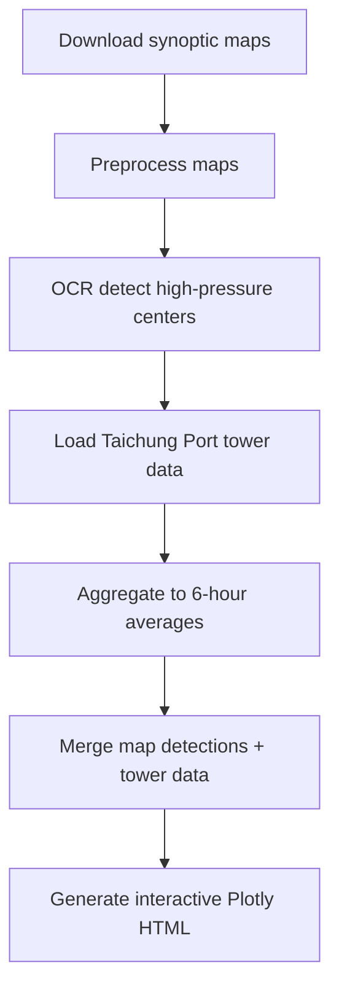

# East Asia Surface Weather Map OCR (H-High Center Detection)

This project uses OCR to detect high-pressure centers on East Asia surface weather maps (focused on Taiwan and nearby regions) and links them to local observations near Taichung Port, Taiwan.

The interactive HTML output lets you hover to see:
- Latitude/longitude of the cursor
- Labeled pressure value of detected high-pressure centers
- 6-hour averaged wind speed and pressure at Taichung Port (24 18'45.5"N, 120 31'36.3"E)

The HTML also supports zooming/panning and exporting the current view as an image.

## Motivation
The goal is to explore the relationship between the position of the continental cold high-pressure system and wind speed in the Taiwan Strait.

## Data Sources
- Surface weather maps: Atmospheric Science Research & Application Data Bank (ASRAD)
  The maps are published every 6 hours.
  Source: https://asrad.pccu.edu.tw/dbar/
- Taichung Port tower data: Bureau of Standards, Metrology and Inspection (BSMI), Taiwan
  Original data at 1 Hz is aggregated into 6-hour averages.

## Data Access Notes
- Surface weather maps (ASRAD) require registration before download. Please create an account on the ASRAD weather map archive and follow their access rules.
- Taichung Port tower data is not publicly available in this repository. You must either:
  1. Apply for the original data (free) from Taiwan BSMI, or
  2. Download from my GitHub repo: `https://github.com/eqiq3322/kline_mettower_bsmi.git` under `DATA/bsmikline/agg`.

## BSMI Data Format
Expected header (CSV):
`TIMESTAMP,WS_100,WS_69W,WS_38W,WD_97,WD_35,AT_95,RH_95,BP_93,GustFactor,TI_10min,MA_10min,MA_1h,MA_6h,MA_1mo`

Field notes:
- `WS_*`: wind speed
- `WD_*`: wind direction
- `RH_*`: relative humidity
- `AT_*`: air temperature
- `BP_*`: pressure

## Important Data Warning
Surface weather maps from 2019/01/01 to 2019/10/20 are garbage data: grayscale, blurry, and unusable. Do NOT use them.

## Features
- OCR-based detection of high-pressure centers on synoptic maps
- Interactive Plotly HTML visualization
- Hover tooltips with geographic coordinates and local observations
- Exportable view (snapshot)
- Supports zooming and geographic navigation
- Uses conic (Lambert conformal conic) projection

## Example Output


## Workflow


## Repository Layout
- `python/detectH.py`: Main pipeline (OCR + visualization)
- `python/detectH_latlongrid.py`: Adds a thick frame for 10-60N and 100-150E
- `python/detectH_multipleperiods.py`: Multi-period analysis (multiple time ranges in one run)
- `python/process_wind.py`: Wind data cleaning and 10-min resampling
- `python/download_maps.py`: Batch downloader for surface maps
- `python/calibrate_map_conic.py`: LCC projection calibration tool
- `html/detectH.html`: Basic square frame output
- `html/detectH_latlongrid.html`: Output with thick 10-60N / 100-150E frame
- `html/detectH_multipleperiods.html`: Output for multiple time ranges in one figure
- `example/`: Example output screenshots

## Setup
```bash
python -m venv .venv
source .venv/bin/activate   # Windows: .venv\Scripts\activate
pip install -r requirements.txt
```

## Quick Start
```bash
python python/detectH.py
```

## Configuration
Edit `config.yaml` to change input/output paths and time ranges.  
CLI arguments override `config.yaml`:
```bash
python python/detectH.py --config config.yaml --start "2019-11-01 00:00" --end "2019-11-03 23:59"
python python/detectH_latlongrid.py --output-html html/detectH_latlongrid.html
python python/detectH_multipleperiods.py --config config.yaml
```

## Notes
- Large raw map images and intermediate artifacts are not included in the repository.
- Input data is expected at `../sfcmap` and `../DATA` relative to this project folder.
